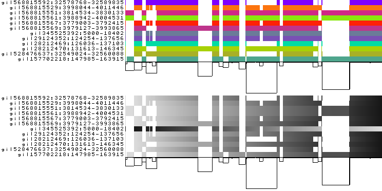
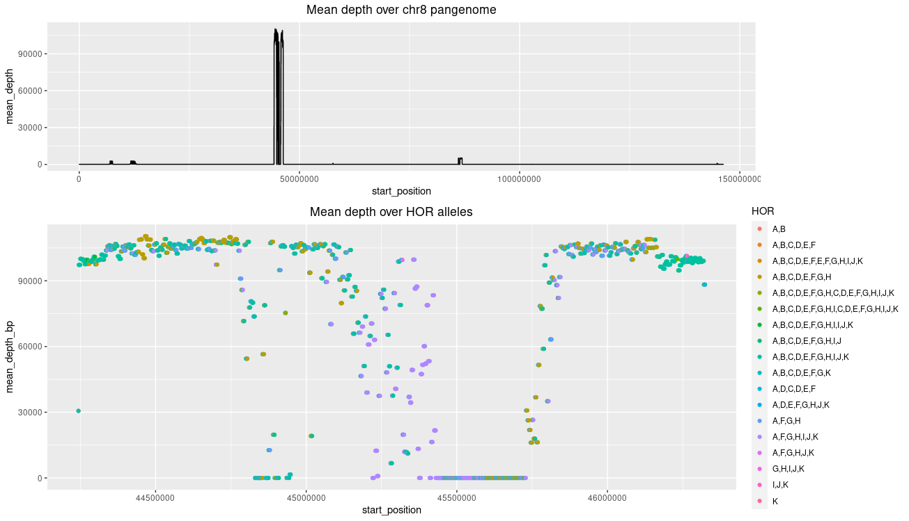
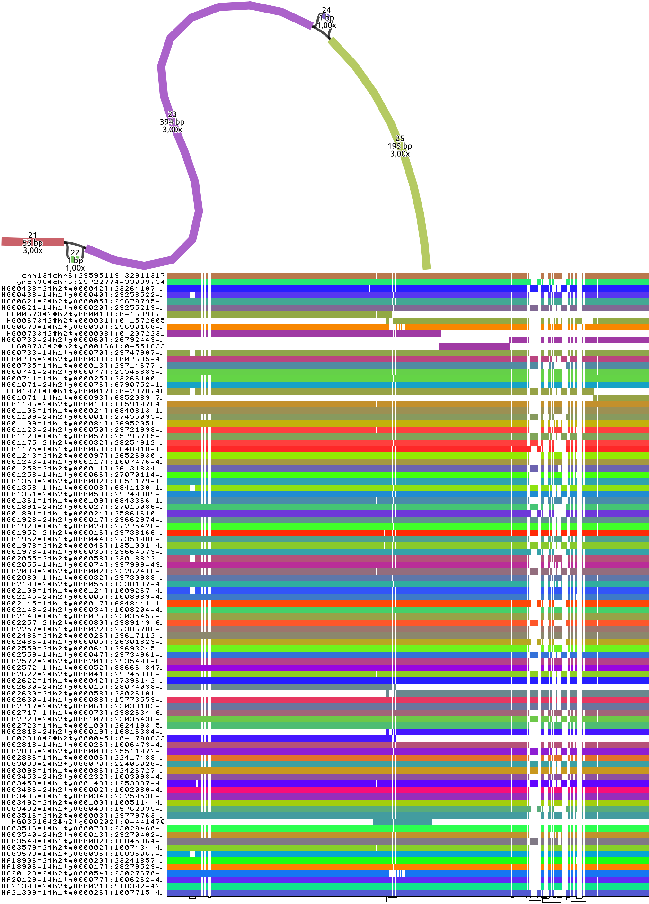
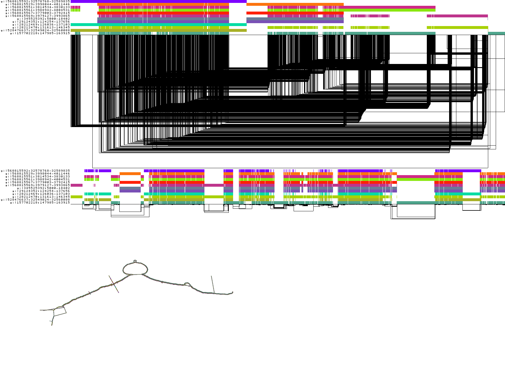
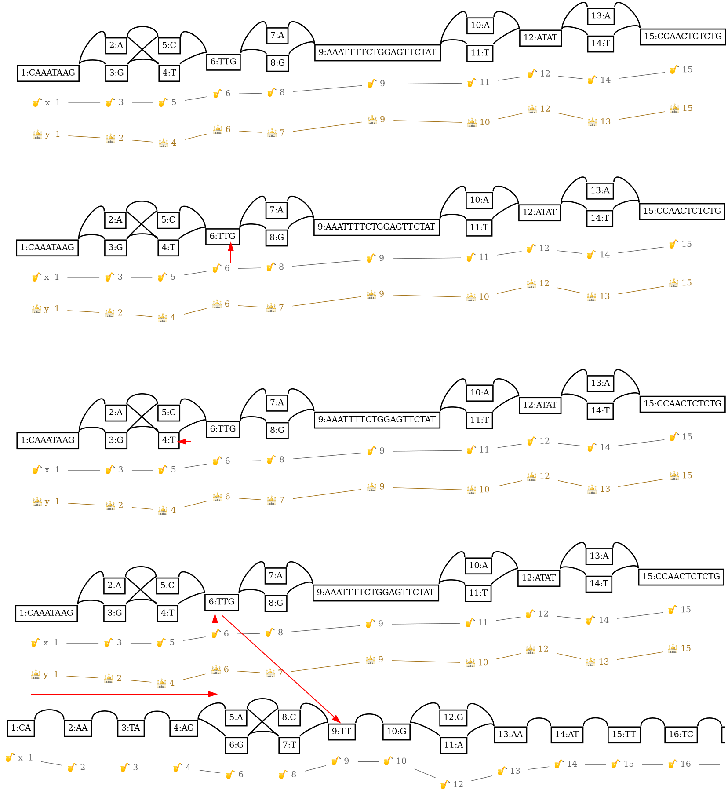
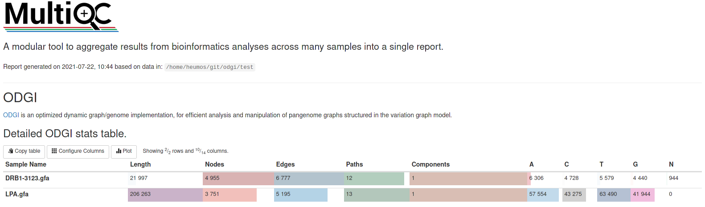

.. meta::
   :description: odgi: optimized dynamic genome/graph implementation
   :keywords: variation graph, pangenome graph

==================================
Welcome to the odgi documentation!
==================================

In standard genomic approaches sequences are related to a single linear reference genome introducing reference bias.
`Pangenome graphs <https://pangenome.github.io/>`__ encoded in the variation graph data model describe the all versus all alignment of many sequences.
Representing large pangenome graphs with minimal memory overhead requires a careful
encoding of the graph entities. It is possible to build succinct, static data structures to
store queryable graphs, as in `xg <https://github.com/vgteam/xg>`__, but dynamic data structures are more tricky
to implement.

The optimized dynamic genome/graph implementation `odgi <https://github.com/pangenome/odgi>`__ follows the dynamic
`GBWT <https://github.com/jltsiren/gbwt>`__ in developing
a byte-packed version of the graph, edges, and paths through it. The node's id is stored as a ``uint64_t`` and its
sequence is stored as a plain ``std::string``. Bit-compressed dynamic byte arrays, with a local alphabet encoder,
represent the local neighbourhood
of the node:

    1) The node's edges, and
    2) the paths crossing the node.

To ensure minimal memory occupation, only the deltas of the neighbouring steps of a path are hold.

``odgi`` provides a set of tools ranging from graph building, manipulation, layouting, over graph statistics to graph
visualization and gene annotation lift overs. The following figure gives an overview.

.. image:: /img/odgi_tools.png

Methods provided by ODGI (in black) and their supported input (in blue) and output (in red) data formats.

For a light dive into ``odgi``, just visit the :ref:`quick_start` section.

.. toctree::
    :maxdepth: 1
    :hidden:

    Welcome <self>
    rst/installation
    rst/quick_start
    rst/tutorials
    rst/commands
    rst/multiqc
    rst/tools_using_odgi
    rst/binding

Core Functionalities
--------------------

**Click on the images below for more details.**

.. |remove_artifacts_and_complex_regions| image:: img/chr8.pan.clean.sort.png
    :target: rst/tutorials/remove_artifacts_and_complex_regions.html

.. list-table::
    :widths: 40 60
    :align: center

    * - |exploratory_analysis|
      - **Exploratory Analysis**

        + Translate GFAv1 to ODGI format
        + Highlight different graph features in 1D
        + Create 1D visualization of a particular region

    * - |detect_complex_regions|
      - **Detect Complex Regions**

        + Download human chr8 pangenome
        + Calculate depth over pangenome
        + Plot the depth
        + Explore the centromer's organization

    * - |extract_selected_loci|
      - **Extract Selected Loci**

        + Extract a subgraph of LPA graph
        + Visualize subgraph
        + Extract MHC *locus* of human chr6
        + Visualize MHC *locus*

    * - |sorting_layouting|
      - **Sorting and Layouting**

        + Sort DRB1-3123 graph
        + Metrics of sorted and unsorted graph
        + Compare 1D visualizations
        + 2D layout of DRB1-3123 graph
        + 2D drawing of DRB1-3123 graph
        + gfaestus for interactive visualization

    * - |navigating_and_annotating_graphs|
      - **Navigating and Annotating Graphs**

        + Path to graph position mapping
        + Path to path position mapping
        + Graph to path position mapping
        + Graph offset to path position mapping
        + Graph to reference position mapping
        + Graph to graph position mapping

    * - |remove_artifacts_and_complex_regions|
      - **Remove Artifacts and Complex Regions**

        + Identify problematic regions
        + Remove identified regions
        + Display graph stats
        + Generate 1D visualization

    * - |multiqc_module|
      - **MultiQC Report of Graph Statistics**

        + Create graph statistics
        + Apply MultiQC to statistics YAML
        + Integrate 1D and 2D visualizations into the report

------
Index
------

* :ref:`genindex`
* :ref:`search`